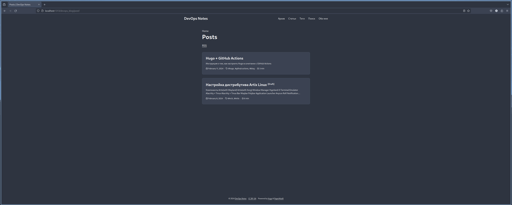
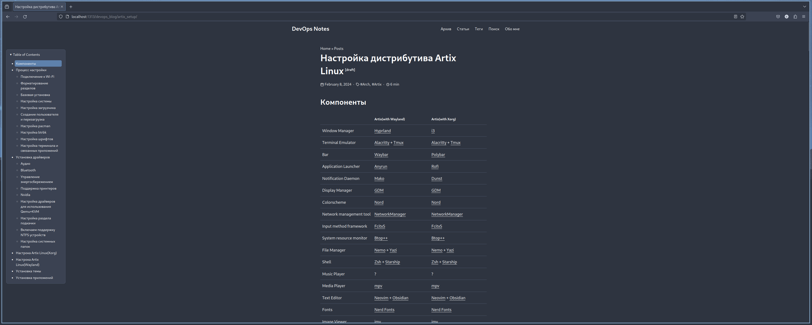
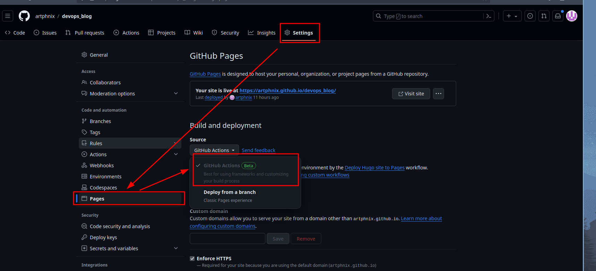
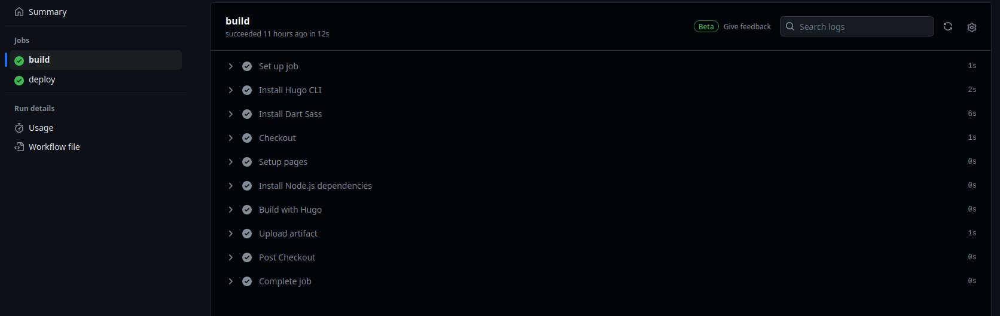
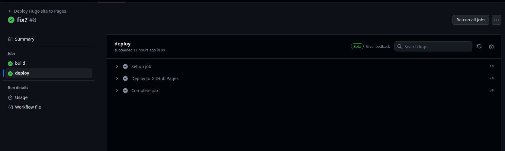
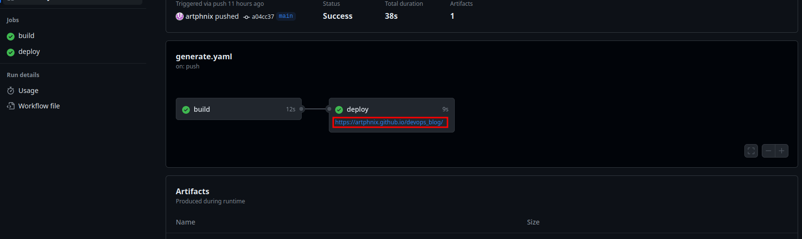

## Почему именно Hugo?

Во время изучения DevOps приходится делать крайне много заметок, так как человечиский мозг не способен запомнить всю информацию в мельчайших подробностях. Поэтому рано или поздно появится желание найти удобный инструмент для хранения заметок. Мой выбор пал на Hugo. Но почему именно на него?


Когда я выбирал инструмент для создания блога/сайта с заметками, я рассматривал следующие варианты:

- Astro
- Hugo
- Obsidian(в качестве централизованного хранилища)
- Notion(в качестве централизованного хранилища)

Последний пункт я сразу откинул, так как Notion без платной подписки крайне урезанный. Obsidian же мне понравился и я его использую до сих пор, но я его использую с интеграцией в Hugo и мою конфигурацию Neovim(Об этом в другой раз). Я не стал использовать исключительно Obsidian, потому что насколько мне известно он не имеет веб-интерфейса.

В итоге я начал выбирать между Astro и Hugo. И тут сделать выбор было крайне просто. Дело в том, что в Hugo страница это markdown, а в Astro несмотря на то, что процесс гораздо упрощен, сайт все равно делается на JS-технологиях, которыми в данный момент времени я не слишком хорошо владею!

## Hugo

### Установка Hugo

Hugo можно установить двумя способами, либо из репозитория своего дистрибутива, например:

```sh
yay -S hugo
```

либо с помощью golang:

```sh
CGO_ENABLED=1 go install -tags extended github.com/gohugoio/hugo@latest
```

После установки мы можем проверить версию данного инструмента, чтобы убедиться установился ли он.

```sh
hugo version
```

### Создание блога

Чтобы создать проект на Hugo достаточно вести данную комманду:

```sh
hugo new site MyCoolBlog --format yaml --force
```

Данной коммандой мы создаем новый сайт с названием *MyCoolBlog*, заменяя уже созданные файлы, если они есть и в качестве инструмента для настроек мы указываем, что хотим использовать yaml.

В итоге будет создана следующая структура файлов:

```sh
drwxr-xr-x   - phnix 11 фев 10:28  .
drwxr-xr-x   - phnix 11 фев 10:28 ├──  archetypes
.rw-r--r-- 102 phnix 11 фев 10:28 │  └──  default.md
drwxr-xr-x   - phnix 11 фев 10:28 ├──  assets
drwxr-xr-x   - phnix 11 фев 10:28 ├──  content
drwxr-xr-x   - phnix 11 фев 10:28 ├──  data
.rw-r--r--  74 phnix 11 фев 10:28 ├──  hugo.yaml
drwxr-xr-x   - phnix 11 фев 10:28 ├──  i18n
drwxr-xr-x   - phnix 11 фев 10:28 ├──  layouts
drwxr-xr-x   - phnix 11 фев 10:28 ├──  static
drwxr-xr-x   - phnix 11 фев 10:28 └──  themes
```

Давайте разберем, что же здесь есть.

1. **archetypes** - в данном каталоге лежат шаблоны, которые будут использоваться при создании нового контента.
2. **assets** - каталог для ассетов(css, js и тому подобное)
3. **content** - каталог, в котором и будет храниться весь ваш сайт и его содержимое в виде markdown страниц.
4. **data** - хранит дополнительную информацию для генерации файлов. Наполняется пользователем.
5. **i18n** - каталог, в котором хранятся файлы перевода. Например: ru.yaml
6. **layouts** - каталог, в котором можно переопределить те или иные элементы темыЯ(шаблона) на основе, которого работает сайт.
7. **static** - каталог, который хранит статичную информацию
8. **themes** - каталог, в котором хранятся используемые темы

### Установка темы

Как было сказано выше для того, чтобы сайт работал и отображался корректно нужна тема. Я использую кастомный вариант [PaperModX](https://github.com/reorx/hugo-PaperModX), который стилизован под тему [Nord](https://www.nordtheme.com/).





PaperModX был выбран по ряду причин:

- уже настроенная система поиска;
- поддержка страницы-портфолио;
- поддержка вложенных постов(чуть позже разберем на примере);
- TOC располагается не в центре, а сбоку для удобства;
- Поддержка мета-информации о посте;
- И многое другое.

Теперь же давайте установим данную тему:

```sh
git clone https://github.com/reorx/hugo-PaperModX themes/PaperModX --depth=1
```

После установки вы можете изменить по своему желанию цветомую схему. Файл отвечающий заэто расположен здесь: ***themes/PaperModX/assets/css/core/theme-vars.css***.

### Настройка Hugo

Теперь перейдем к самому главному шагу: настройке hugo.

Ниже расположена моя конфигурация, где прокомментированы все опции.

```yaml
baseURL: "https://artphnix.github.io/devops_blog/" # URL сайта
title: DevOps Notes # Заголовок сайта
paginate: 100 # Пагинация
theme: PaperModX # Тема, которая используется

# Поддержка русского языка
defaultConctentLanguage: ru # Язык по-умолчанию
# defaultContentLanguageInSubdir: true
languageCode: ru-RU
languageName: Russian

buildDrafts: false # Включать ли черновики в итоговый результат
buildFuture: false # Включать ли заплонированные посты в итоговый результат
buildExpired: false # Включать ли посты с истекщим сроком в итоговый результат
pygmentsUseClasses: false # Позволяет использовать CSS классы для подсветки кода

# Данные строки оптимизируют итоговый результат
minify:
  disableXML: true
  minifyOutput: true

outputs:
  home:
    - HTML
    - RSS
    - JSON # этот пункт крайне важный

params:
  env: production # Чтобы включить различные штуки для production
  title: DevOps Notes # Заголовок
  keywords: [devops, linux, Blog, Portfolio, PaperModX] # Ключевые слова по которым будет искаться сайт
  author: Arthur Lokhov
  # author: ["Me", "You"] # multiple authors
  # images: ["/og-preview.png"]
  DateFormat: "January 2, 2006" # Формат для даты
  defaultTheme: dark # Какую тему использовать
  disableThemeToggle: true # Использовать ли переключение тем

  ShowReadingTime: true # Показывать необходимое для прочтения поста время
  ShowShareButtons: false # Показывать кнопки для того, чтобы поделиться постом
  ShowPostNavLinks: true # Отображать ли ссылки на следующую или предыдущую статью
  ShowBreadCrumbs: true # Над заголовком статьи будут изображены "хлебные крошки"
  ShowCodeCopyButtons: false # Показывать ли кнопку скопировать для кода

  disableSpecial1stPost: false # Хз что-это
  disableScrollToTop: false # Отключить ли кнопку "Перемотать на самый вверх"
  comments: false # Комментарии на статичном сайте?
  hidemeta: false # Отклюить ли строку мета-информации для поста
  hideSummary: false # Отключить ли отображение мета-информации на странице всех постов
  EnableInstantClick: false # Хз что-это
  enableEmoji: true # Поддерживать ли эмоции
  math: true # Поддерживать ли математические формулы

  showtoc: true # Включить ли меню контента
  tocopen: true # Открыто или свернуто меню контента по-умолчанию
  TocSide: 'left'  # or 'right'

  # Портфолио
  profileMode:
    enabled: true # Использовать ли страницу-портфолио
    title: var phNix := "Phoenix" # Заголовок для профиля
    imageUrl: "images/icon.png" # Картинка для профиля
    imageWidth: 250 # Ширина профиля
    imageHeight: 250 # Высота профиля
    # Ниже можно перечислить кнопки под профилем
    # buttons:
    #   - name: Статьи
    #     url: post

  # Социальные сети https://adityatelange.github.io/hugo-PaperMod/posts/papermod/papermod-icons/
  socialIcons:
    - name: github
      url: "https://github.com/artphnix"
    # - name: gitlab
    #   url: "Сделать аккаунт"
    - name: email
      url: "mailto://crai-dvps@tuta.io"

  # Настройка поисковой системы
  fuseOpts:
    isCaseSensitive: false # Важен ли регистер
    shouldSort: true # Использовать ли сортировку
    location: 0
    distance: 1000
    threshold: 0.4
    minMatchCharLength: 0
    keys: ["title", "permalink", "summary", "content"] # На основе какого содержимого будет происходить поиск

# Главное меню
menu:
  main:
    - identifier: archives
      name: Архив
      url: /archives/
      weight: 10
    - identifier: post
      name: Статьи
      url: /post/
      weight: 20
    - identifier: tags
      name: Теги
      url: /tags/
      weight: 30
    - identifier: search
      name: Поиск
      url: /search/
      weight: 50
    - identifier: about
      name: Обо мне
      url: /about/
      weight: 60


# Настройка markdown
markup:
  highlight:
    # anchorLineNos: true
    codeFences: true
    guessSyntax: true
    lineNos: false
    style: nord
    tabWidth: 2
```

Среди важного адрес baseURL должен совпадать с будущей страницей github pages. Иначе сайт будет не правильно отображаться и работать.

Но это еще не все. Нам надо создать страницу поиска, страницу архива и страницу "об авторе".

Для этого в папке content, создаем три файла со следующим содержимым

***search.md***:

```md
---
title: "Поиск" # in any language you want
layout: "search" # necessary for search
summary: "search"
placeholder: "Введите желаемый запрос"
---
```

***about.md***:

```md
---
title: 'Обо мне'
date: 2024-02-10T17:39:04+03:00
tags: [""]
author: ""
showToc: false
TocOpen: false
draft: false
hidemeta: true
comments: false
description: "Немножко информации обо мне"
canonicalURL: ""
disableShare: true
hideSummary: true
searchHidden: true
ShowReadingTime: false
ShowBreadCrumbs: false
ShowPostNavLinks: false
---

<!-- Напиши про себя -->
```

***archives.md***:

```md
---
title: "Архив"
layout: "archives"
url: "/archives/"
summary: archives
---
```

Нужно это было сделать для того, чтобы hugo правильно настроил свой функционал.

### О структуре каталога content

Ниже приведен пример того, как должно выглядить содержимое данного каталога

```sh
drwxr-xr-x    - phnix 11 фев 11:08 -N  .
.rw-r--r--    0 phnix 10 фев 18:55 -- ├──  _index.md
.rw-r--r--  423 phnix 11 фев 11:08 -- ├──  about.md
.rw-r--r--   83 phnix 10 фев 17:21 -- ├──  archives.md
drwxr-xr-x    - phnix 11 фев 10:41 -N ├──  post
.rw-r--r--  16k phnix 11 фев 10:07 -M │  ├──  1-test.md
drwxr-xr-x    - phnix 11 фев 11:10 -N │  └──  hugo_setup
drwxr-xr-x    - phnix 11 фев 10:55 -N │     ├──  img
.rw-r--r-- 122k phnix 11 фев 10:55 -N │     │  ├──  theme1.png
.rw-r--r-- 249k phnix 11 фев 10:55 -N │     │  └──  theme2.png
.rw-r--r--  14k phnix 11 фев 11:10 -N │     └──  index.md
.rw-r--r--  174 phnix 10 фев 17:10 -- └──  search.md
```

Если вам надо создать подтему для группировки постов, то создавайте папку и используйте *_index.md*, если вы хотите сгруппировать один единственный пост, но с например картинками, то используйте *index.md*.

Грубо говоря *index.md* - пост, *_index.md* - страница сайта, которая подгружает весь контент на том же уровне вложенности

## GitHub Actions

Теперь когда сайт готов, надо его установить в качестве GitHub Pages.

Для этого создадим две jobs:

- build: соберет сайт из исходников
- deploy: установит собранный сайт в качестве github pages

Для начала надо создать репозиторий для нашего сайта и включить Github pages в настройках.



Теперь создадим файл: ***/.github/workflows/generate.yaml*** со следующим содержимым.

Опять же все в файле прокомментировано и интуитивно понятно.

```yaml
# Наименомание нашей workflow
name: Deploy Hugo site to Pages

on:
  # Запускается когда мы делаем push в стандартную ветку
  push:
    branches:
      - main

# Разрешение для GITHUB_TOKEN
permissions:
  contents: read
  pages: write
  id-token: write

# Настройки для многопоточности
concurrency:
  group: "pages"
  cancel-in-progress: false

# Установка некоторых значений по-умолчанию
defaults:
  run:
    shell: bash

# Наши jobs - или же задачи, которые будут выполняться при пуше
jobs:
  build:
    # На чем будет выполняться
    runs-on: ubuntu-latest
    # Переменные среды
    env:
      HUGO_VERSION: 0.122.0
    # Шаги, которые воспроизводятся последовательно, если один не выполняется, то job прервется.
    steps:
      - name: Install Hugo CLI
        run: |
          wget -O ${{ runner.temp }}/hugo.deb https://github.com/gohugoio/hugo/releases/download/v${HUGO_VERSION}/hugo_extended_${HUGO_VERSION}_linux-amd64.deb \
          && sudo dpkg -i ${{ runner.temp }}/hugo.deb
      - name: Install Dart Sass
        # Без dart-sass сайт может криво отображаться
        run: sudo snap install dart-sass
      - name: Checkout
        uses: actions/checkout@v4
        # Проверяем в том числе подмодули, если они есть
        with:
          submodules: recursive
          fetch-depth: 0
      - name: Setup pages
        id: pages
        uses: actions/configure-pages@v4
      - name: Install Node.js dependencies
        run: "[[ -f package-lock.json || -f npm-shrinkwrap.json ]] && npm ci || true"
      - name: Build with Hugo
        env:
          HUGO_ENVIRONMENT: production
          HUGO_ENV: production
        # Сборка сайта через hugo, с флагами gc(очистка от мусорных файлов) и minify(минификация)
        run: |
          hugo \
            --gc \
            -- minify \
            -- baseURL "${{ steps.pages.outputs.base_url }}/"
      - name: Upload artifact
        uses: actions/upload-pages-artifact@v3
        with:
          path: ./public

  deploy:
    environment:
      name: github-pages
      url: ${{ steps.deployment.outputs.page_url }}
    runs-on: ubuntu-latest
    needs: build
    steps:
      - name: Deploy to GitHub Pages
        id: deployment
        uses: actions/deploy-pages@v4
```

После чего просто делаем *git push* и оно начнет собираться.





После успешной сборки GA нам выдаст ссылку на наш сайт.


