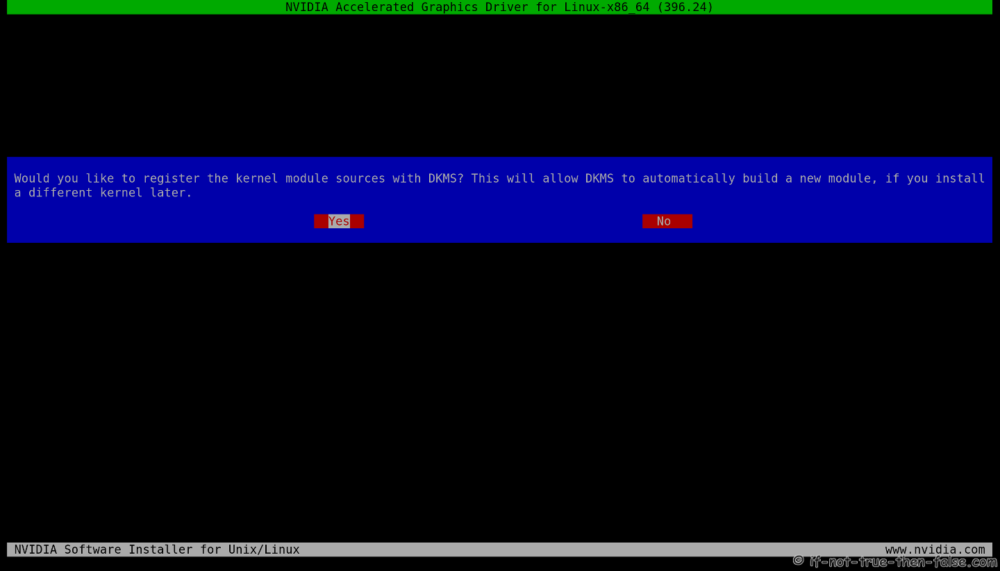
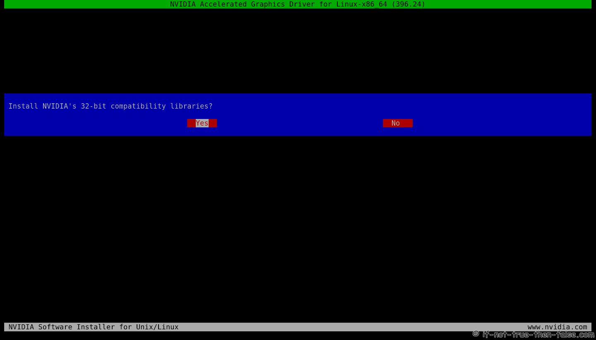
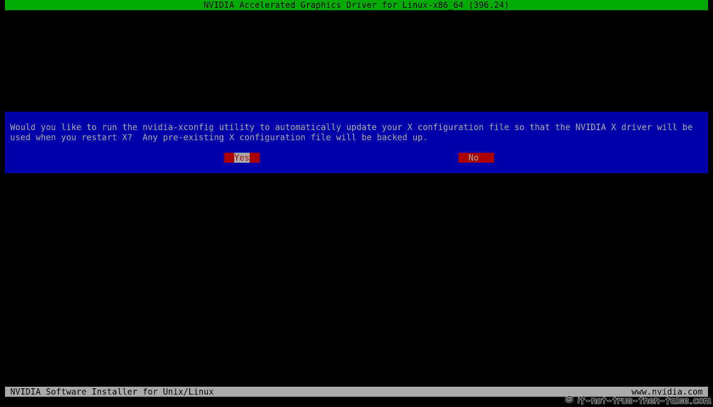
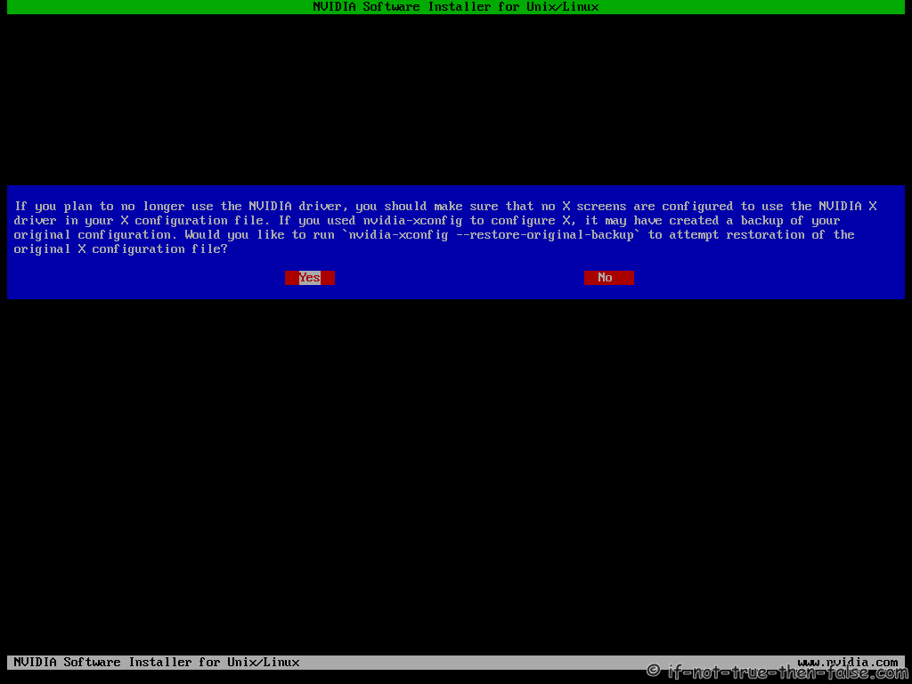
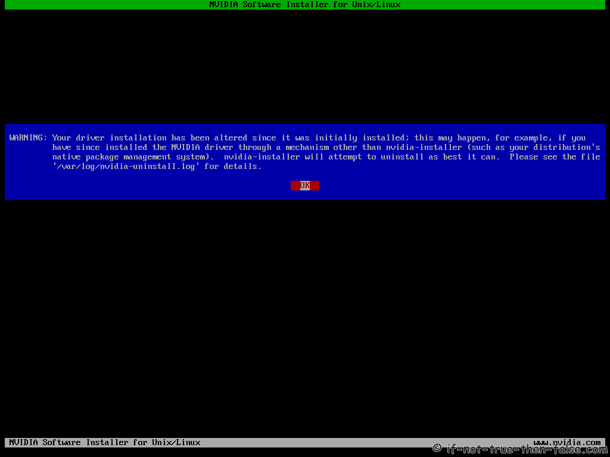

Данное руковдство работает для следующих дистрибутивов:

- Debian
- Ubuntu
- Linux Mint
- LMDE

## Перед тем как устанавливать Nvidia

### Проверяем поддерживается ли видеокарта

```sh
lspci |grep -E "VGA|3D"
```

Пример вывода:

```sh
01:00.0 VGA compatible controller: NVIDIA Corporation GA104 [GeForce RTX 3070 Lite Hash Rate] (rev a1)
02:00.0 Non-Volatile memory controller: Realtek Semiconductor Co., Ltd. RTS5763DL NVMe SSD Controller (rev 01)
```

### Nvidia OPTIMUS

Если команда выше возвращает две видеокарты. То есть так как ниже:

```sh
00:02.0 VGA compatible controller: Intel Corporation 2n Generation Core Processor Family Integrated Graphics Controller (rev 09)
01:00.0 VGA compatible controller: NVIDIA Corporation GF106 [GeForce GT 555M SDDR3] (rev a1)
```

или

```sh
00:02.0 VGA compatible controller: Intel Corporation 4th Gen Core Processor Integrated Graphics Controller (rev 06)
01:00.0 3D controller: NVIDIA Corporation GK107M [GeForce GT 750M] (rev a1)
```

Значит ваш компьютер использует Nvidia OPTIMUS. В таком случае данный гайд не будет работать для вас. Если я напишу гайд для такого типа ситуации, то здесь будет ссылка.

### UEFI Secure Boot

Проверяем включен или выключен Secure Boot.

```sh
mokutil --sb-state
```

Пример вывода:

```sh
SecureBoot disabled
Platform is in Setup Mode
```

Если у вас включен Secure Boot, то идем в BIOS и выключаем его.

## Установка проприетарных драйверов Nvidia

Переходим на данный [сайт](https://www.nvidia.com/Download/index.aspx?lang=ru) и устанавливаем нужную версию драйверов.

Далее выполняем данные команды:

```sh
su -i
chmod +x /path/to/NVIDIA-Linux-*.run
apt update
apt upgrade

# Debian/Linux Mint
apt autoremove $(dpkg -l nvidia-driver* |grep ii |awk '{print $2}')
# Ubuntu
apt autoremove $(dpkg -l *nvidia* |grep ii |awk '{print $2}')

# Устанавливаем на время open-source драйвера
apt reinstall xserver-xorg-video-nouveau
reboot

# Устанавливаем зависимости
apt install linux-headers-$(uname -r) gcc make acpid dkms libglvnd-core-dev libglvnd0 libglvnd-dev dracut libc-dev

# Добавляем nouveau в черный список
echo "blacklist nouveau" >> /etc/modprobe.d/blacklist.conf
nvim /etc/default grub
    ## Example row on Debian ##
    GRUB_CMDLINE_LINUX_DEFAULT="quiet rd.driver.blacklist=nouveau"
    ## OR with Ubuntu and Linux Mint ##
    GRUB_CMDLINE_LINUX_DEFAULT="quiet splash rd.driver.blacklist=nouveau"

# Обновляем BIOS или UEFI
update-grub2

# Делаем резервную копию старого initramfs с nouveau
mv /boot/initrd.img-$(uname -r) /boot/initrd.img-$(uname -r)-nouveau

# Генерируем новый initramfs
dracut -q /boot/initrd.img-$(uname -r) $(uname -r)
systemctl set-default multi-user.target
reboot
```

Наконец-то переходим к установке:

```sh
su -
./NVIDIA-Linux-*.run
```





```sh
systemctl set-default graphical.target
reboot
```

## Настройка Nvidia

### Создание `/etc/modprobe.d/nvidia.conf`

```sh
echo "options nvidia_drm modeset=1" >> /etc/modprobe.d/nvidia.conf
```

### Создание `/etc/dracut.conf.d/nvidia.conf`

```sh
cat << EOF > /etc/dracut.conf.d/nvidia.conf
add_drivers+=" nvidia nvidia_modeset nvidia_uvm nvidia_drm "
install_items+=" /etc/modprobe.d/nvidia.conf "
EOF
```

### Изменеие в /etc/default/grub

```sh
# Убедить что есть splash параметр
nvim /etc/default/grub
    GRUB_CMDLINE_LINUX_DEFAULT="quiet splash rd.driver.blacklist=nouveau"
update-grub2
```

### Генерируем initramfs

```sh
# Только для текущего ядра
dracut -qf /boot/initrd.img-$(uname -r) $(uname -r)

# Для всех ядер
dracut -qf
reboot
```

## Удаление драйверов Nvidia

Запуск процесса удаления:

```sh
su -
nvidia-installer --uninstall
```




### Производим разблокировку nouveau

```sh
nvim /etc/modprobe.d/blacklist.conf # Удаляем строку отвечающую за блокировку nouveau
nvim /etc/default/grub # Удаляем rd.driver.blacklist=nouveau из GRUB_CMDLINE_LINUX_DEFAULT
update-grub2

# Делаем резервную копию старого initramfs с nvidia
mv /boot/initrd.img-$(uname -r) /boot/initrd.img-$(uname -r)-nvidia

# Генерируем новый initramfs
dracut -q /boot/initrd.img-$(uname -r) $(uname -r)
reboot
```

### Восстанавливаем initramfs-tools и удаляем dracut

```sh
apt autoremove dracut
apt install firmware-misc-nonfree
apt install initramfs-tools
```

Теперь вы знаете почти все что надо для работы с Nvidia в X11. Удачи!!
